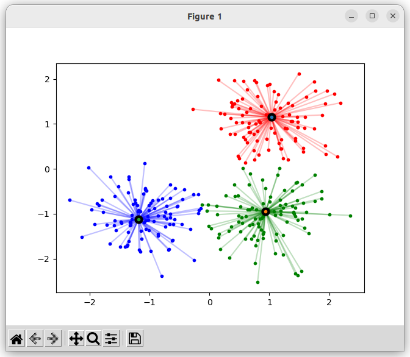
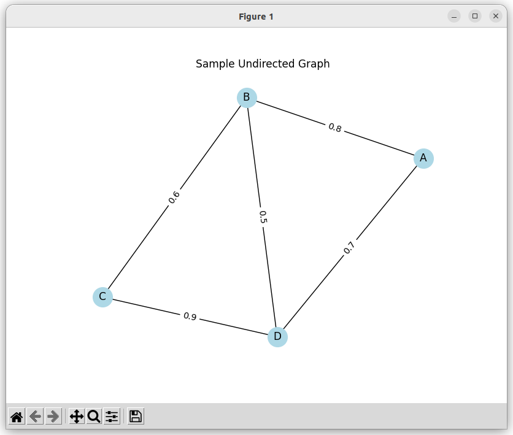
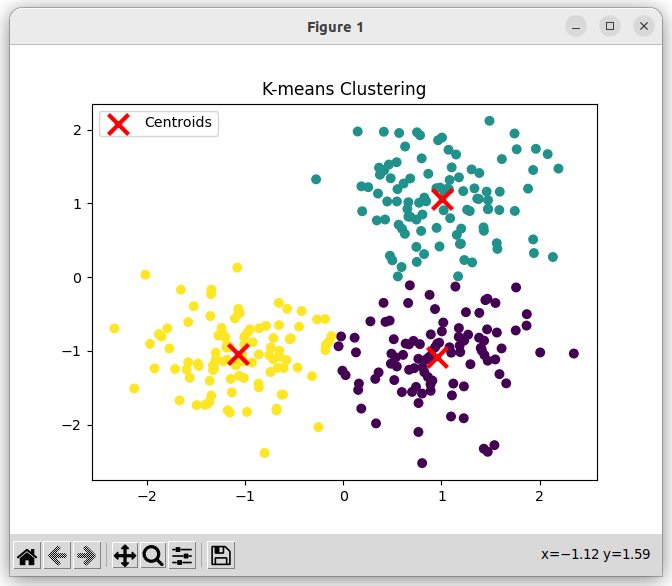
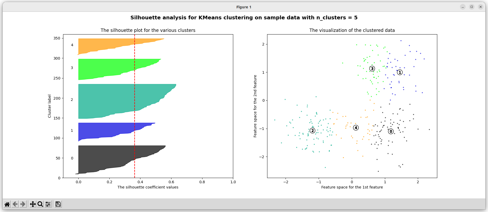
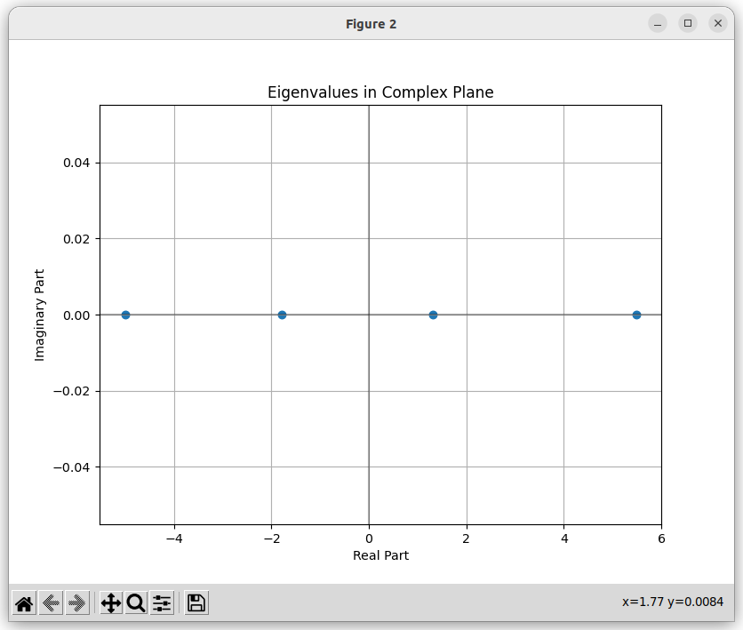

# Backgrounds for the project

## Affinity Propagation

- api : https://scikit-learn.org/1.5/modules/generated/sklearn.cluster.AffinityPropagation.html
- reference: https://scikit-learn.org/stable/auto_examples/cluster/plot_affinity_propagation.html#sphx-glr-auto-examples-cluster-plot-affinity-propagation-py

## Undirected Graph

- api: https://networkx.org/documentation/stable/reference/classes/graph.html
- reference: https://networkx.org/documentation/stable/auto_examples/drawing/plot_weighted_graph.html

## K-means clustering

- api: https://scikit-learn.org/stable/modules/generated/sklearn.cluster.KMeans.html
- reference: https://scikit-learn.org/stable/auto_examples/cluster/plot_kmeans_digits.html#sphx-glr-auto-examples-cluster-plot-kmeans-digits-py

## Silhouette Coefficient (Silhouette Score)

- api: https://scikit-learn.org/stable/modules/generated/sklearn.metrics.silhouette_score.html
- reference: https://scikit-learn.org/stable/auto_examples/cluster/plot_kmeans_silhouette_analysis.html#sphx-glr-auto-examples-cluster-plot-kmeans-silhouette-analysis-py

## Eigenvalues of Graph 

- api: https://networkx.org/documentation/stable/reference/generated/networkx.linalg.spectrum.laplacian_spectrum.html
- reference: https://networkx.org/documentation/stable/auto_examples/drawing/plot_eigenvalues.html

